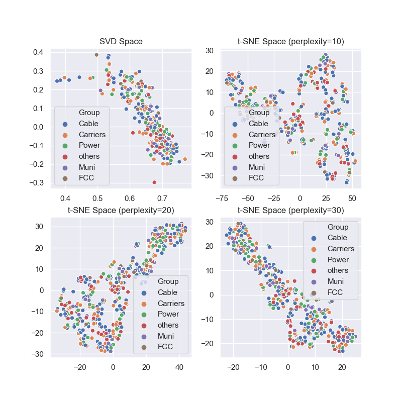
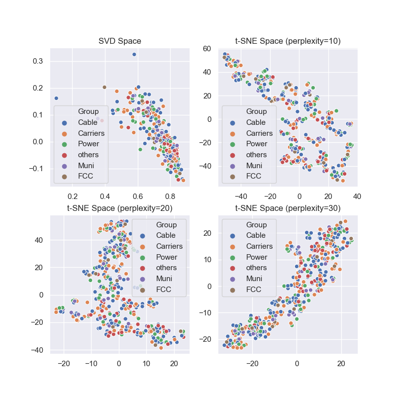

# Visualization of filings on FCC policy proposals
This project uses simple natural language processing tools such as FastText for word2vec embeddings, and count-based methods such as Tf-Idf to visualize differnet positions taken by distinct stakeholders in the communication policy space. The visualization is based on standard dimensionality reduction techniques (singular value decomposition and t-SNE).

One issue concerns restrictions placed on access to utility poles. Utility poles not only carry power lines, but also support communication network gear such as fiber optic cables and related hardware. The poles thus have a *power space* (transmission lines, usually higher up the pole) and also a *communication space* (usually lower on the pole). Network gear may be attached directly to the poles (pole mounted), or attached to steel cables running along poles (strand mounted). Poles may be owned by local governments or utility companies. There are regional variations in how quickly and easily communication companies can obtain permissions to access poles to attach new equipment or modify existing equipment. The FCC recently moved to relax these restrictions. Naturally different parties have starkly different views and these are represented in filings by individuals and organizations (including lobbying groups).  

## Common text corpus 
Visualizing document embeddings in 2D space SVD and t-SNE (with varying perplexitities) when the embeddings are created from a corpus containing sample filings from all groups. 

## Cable and ISP company text corpus 
Visualizing document embeddings created from a corpus containing sample filings from only cable and internet service providers. 

In this initial attempt, the filings by different (hand labeled) groups such as utility companies, cable companies, local government, wireless carriers do not exhibit any clear clustering. This may be because the corpora used to create the embeddings were too small (5 percent random subsamples used, to save on training time). 

### Count-based visualization
A different attempt based on using TF-Idf (Jupyter notebooks in [R](./FCC17_84.ipynb) and [Python](./fccPyClusters.ipynb)) with
[D3 visualization](https://bl.ocks.org/petecarkeek/c7da7590422d55e0b1dde588d9835df1) on bl.ocks.org

### Notes
The FCC17-84 notebook describes the data gathering process. Text files generated from the downloaded PDFs using pdf2txt utility.
